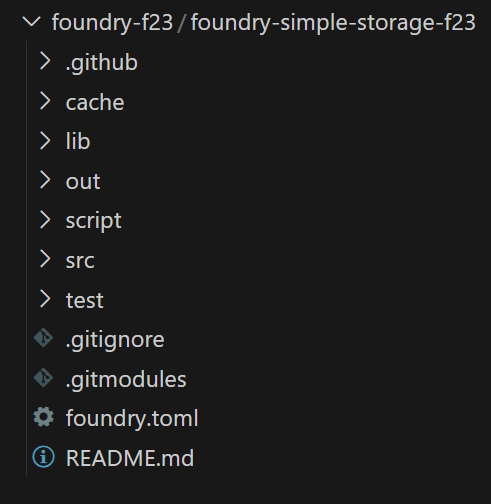

# Foundray Simple Storage

## Introduction

Welcome to Foundry 101. Throughout this course, you will acquire the skills you’ll need to start developing your smart contracts and protocols using the best web3 development tools and frameworks like _**Chainlink**_, _**Alchemy**_, and _**Foundry**_.

### What is Foundry?

Foundry is a relatively new but rapidly growing smart contract development framework known for its efficiency and modularity. The best short description of this powerful tool can be found in the [Foundry Book](https://book.getfoundry.sh/):

```Solidity
Foundry manages your dependencies, compiles your project, runs tests, deploys, and lets you interact with the chain from the command-line and via Solidity scripts.
```

Please take a moment to bookmark the [Foundry Book](https://book.getfoundry.sh/). It is the most comprehensive resource that has the answers to all your questions. It will be handy along the way.

Foundry has numerous pros, such as:

-   It **leverages Rust** for compilation, offering significantly faster build times compared to frameworks like Hardhat or Brownie.
-   It's entirely **Solidity-based**, eliminating the need to learn other programming languages
-   Its **documentation is comprehensive**.

## Development environment setup (Windows)

Download VS Code from [here](https://code.visualstudio.com/).

The setup is straightforward.
If this is your first time using VS Code spend some time and navigate through the "Get Started with VS Code" instructions. These valuable tips could clear many hurdles in your upcoming coding adventures. Moreover, to get an even better grasp on using VS Code, consider going through the [Visual Studio Code Crash Course](https://www.youtube.com/watch?v=WPqXP_kLzpo) from freeCodeCamp.

### VS Code terminal

VS Code has a built-in terminal emulator, often simply referred to as the VS Code terminal. It provides a command-line interface (CLI) environment directly within VS Code, allowing you to interact with your operating system and run various tools and utilities.

You can open up multiple terminals at the same time running different shells ranging from bash, Powershell, WSL and many more depending on what you have configured.

Use the `+` button to create a new terminal or the trash button to kill the current terminal.

Whether you are learning **Foundry** for development work or security work, moving fast is one of the keys to efficiency. VS Code is very versatile in terms of keyboard shortcuts, you can learn more [here](https://code.visualstudio.com/docs/getstarted/keybindings).

### What is WSL?

**WSL** stands for **Windows Subsystem for Linux**. It's a feature introduced by Microsoft that allows you to run a Linux environment directly on your Windows machine. This means you can use familiar Linux command-line tools and applications alongside your existing Windows programs. To ensure that your code runs on various machines using Unix-based systems like Mac and Linux, you'll find WSL to be immensely beneficial.

### How to install WSL?

Installing WSL is very easy, just open your Windows Terminal (comes preinstalled in Windows 11, available on Microsoft Store on Windows 10) and type:

```Solidity
wsl --install
```

After your system reboots, the Terminal will open automatically and proceed with the installation.

You will be asked to provide a new UNIX username and an associated password.

### Making Visual Studio Code Compatible with WSL

The next step is to ensure our VS Code is compatible with WSL.

Open up VS Code and navigate to the Extensions tab. Here, look for the Remote Development extensions and proceed to install each of them. This will enable VS Code to operate with WSL seamlessly. A new icon will appear on the bottom left of the screen called `Open a Remote Window`.

There's even an easier way to connect:

1. In the Windows Terminal, open up a new Ubuntu terminal.
2. Create a new folder by typing in:

```Solidity
mkdir solidity-course
```

1. Change the directory into the newly created folder

```Solidity
cd solidity-course/
```

1. Open VS Code inside the folder by typing in

```Solidity
code .
```

1. WIN! You just created a new instance of VS Code that uses WSL. Everything is correct if on the bottom left of your screen you see a small banner with the text `WSL Ubuntu`.

**Important: When you conduct your projects from a folder inside Windows (ex. Development) inside your documents, it's crucial to know that the WSL console will only access local files inside the WSL instance. Therefore, it's recommended to keep files inside the WSL instance for faster communication and convenience.**

### Git installation

Whether you have it and it needs to be updated or you need to perform a fresh install the best way to approach this is by visiting the [Git Book](https://git-scm.com/book/en/v2/Getting-Started-Installing-Git) and following the instructions there.

Check your git installation calling

```Solidity
git --version
```

Amazing work! You're ready for the next lesson.

## Develop in the cloud using Gitpod

**BIG BOLDED DISCLAIMER: This is not the ideal way to develop smart contracts. While using Gitpod you should never share private information, like a key or a secret phrase. That's if you like to continue being the owner of the associated accounts.**

Gitpod is an online platform that provides cloud-based, pre-configured development environments specifically designed for working with Git repositories. It's similar to Remix IDE, but it allows you to run VS Code in a browser, on a remote server.

Go to [Gitpod's website](https://gitpod.io/login/) and click `Continue with Github`. After that, you'll be able to create a new workspace, starting from a Github repository, using a stable version of VS Code.

You'll be amazed to find out it looks exactly like VS Code. There's also an option to open Gitpod into your VS Code desktop version.

Everything works like in VS Code and thus you should be able to run anything using the same commands.

Gitpod has some [fantastic resources](https://www.gitpod.io/docs/introduction/getting-started) to get you started.

## Foundry Setup

Welcome to this handy guide on installing and operating Foundry, a versatile tool that will add a new level of command-line ease to your developer journey. Whether you're running Windows, Linux or MacOS, we've got you covered with instructions and tips. So sit back, grab a cup of coffee, and let's dive in.

## Prepping your Terminal

First things first. Before we dive into installing Foundry, make sure you have your terminal set up correctly.

If you are using Windows, you should see something like `WSL` or `Ubuntu`. Once you have your terminal environment ready, it’s time for some quick tips to help streamline your workflow.

### Keeping your Terminal Clutter-free

When commands pile up in your terminal, things can get a little overwhelming. Clear it up by simply typing `clear` and hitting `Enter`. Alternatively, use `Command K` if you're on a Mac or `Control K` if you're on Linux or Windows.

**Pro tip:** This is one of my favorite keyboard shortcuts that I use all the time.

### Understanding the Trash Can and the X

The trash can and the X buttons in your terminal perform distinct functions. Hitting `X` simply hides your terminal but retains all the previous lines of code. On the other hand, trashing it essentially deletes whatever is running in it. To open up a clean terminal, hit the trash can and then pull it back using `Toggle` or `Terminal > New Terminal`.

## Installing Foundry

With our terminal set and some tips up our sleeve, let's progress to installing Foundry. Navigate to the [Foundry website](https://book.getfoundry.sh/getting-started/installation) and from the installation tab, fetch the command to install Foundry.

The command would look something like this:

```bash
curl -L https://foundry.paradigm.xyz | bash
```

Hit `Enter` after pasting this in your terminal.

**Note:** You must have Internet access for this to work as it's downloading Foundry from their official website.

## Verifying Your Installation

After running the `curl` command, an output will appear at the bottom of your terminal indicating the detected shell and the fact that Foundry has been added to your `Path`.

For instance, the output can be something like this:

```bash
Detected your preferred shell is bashrc and added Foundry to Path run:source /home/user/.bashrcStart
a new terminal session to use Foundry
```

Now, simply type `foundryup` and `Enter` to install and update Foundry to the latest version. Whenever you want to install an update for Foundry, simply run `foundryup` again.

This will install four components: forge, cast, anvil, and chisel. To confirm the successful installation, run `forge --version`. You should get an output indicating the Forge version as shown below.

```bash
Forge version x.x.x
```

Now, here's something to remember: when you hit the trash can in the top right, it literally 'removes' the terminal. The X button, in contrast, simply hides it.

### Is Foundry Up Not Running?

Don't panic if this command doesn't run. You might have an issue with your path, and you might need to add Foundry to your path. In case you run into this issue, check lesson 6 of the GitHub repo associated with this course. If no debugging tips are available there, feel free to start a discussion on the course's GitHub repo. Before doing so, make sure to check if a similar discussion already exists.

Try typing `forge --version` into your terminal. Have you received an unwelcome output saying `Forge command found`? This implies that you have to rerun the `source` command that Foundry offered during installation.

Note: Most of the time the `bashrc` file gets loaded automatically. However, if this doesn't apply to your setup, the following lines can add the required command to the end of your `Bash profile`. This will ensure that your `bashrc` file loads by default.

```bash
cd ~
echo 'source /home/user/.bashrc' >> ~/.bash_profile
```

> this depends on your operating system, please check foundry docs to see detailed instructions.

## Wrapping Up

And there we have it! Congratulations on installing Foundry and prepping your terminal to work seamlessly with it. Remember, hitting snags during installation is normal, especially if you're new to this. Don't hesitate to engage with the course community via GitHub if you run into issues.

## VS Code setup

### Installing VS Code extensions

1. Open the Extensions view:

There are two ways to do this:

Click the Extensions icon in the Activity Bar on the left side of VS Code.

Use the shortcut Ctrl+Shift+X (Windows/Linux) or Cmd+Shift+X (Mac).

1. Browse or search for extensions:

The Extensions view displays featured extensions by default.

Use the search bar to find a specific extension by name.

1. Install the extension:

Once you've found the extension you want, click the "Install" button.
VS Code will handle the download and installation process.

**That's it! The extension should be ready to use within VS Code.**

### Integrating AI into our work

One of the best extensions that integrates AI in our development is GitHub Copilot

Although it's a premium service, its intuitive AI-powered code autocomplete feature could be a game-changer for you. Of course, you can choose to go with other AI extensions based on your preferences.

You can download GitHub Copilot [here](https://marketplace.visualstudio.com/items?itemName=GitHub.copilot). More details and answers for your GitHub Copilot-related questions are available [here](https://github.com/features/copilot/?editor=vscode#faq).

### Other important VS Code Tips

**_Beware the white dot_**, if you see it, your work is not saved, which means your project won't behave the way you want it to behave.

`` CTRL(CMD) + `  `` opens/closes your terminal. It's the equivalent of pressing the `X` button on the top right part of your terminal.

The `trash can` button, on the left side of the `X` button destroys the terminal, make sure you always remember the difference between these two buttons.

Hooray! This concludes the setup part of this course. Now we get to the fun part, actually developing a project using solidity and foundry.

### More setup ...

Run the following commands in your terminal:

```Solidity
mkdir foundry-f23
cd foundry-f23
```

`mkdir` creates a directory or subdirectory.
`cd` changes the directory.

Moving forward, it's advisable to keep all your repositories in this folder. Thus, you'll always have a place to reference all your code.

## Create a new Foundry Project

Make sure we are in the folder we created in the previous lesson.

**Reminder**: We ran the following commands

```Solidity
mkdir foundry-f23
cd foundry-f23
```

Now type the following commands:

```Solidity
mkdir foundry-simple-storage-f23
cd foundry-simple-storage-f23
```

You can always make the `cd` command faster by pressing the `Tab` key after you type the first couple of letters from the destination name. `Tab` lets you autocomplete a lot of commands/paths.

If you type `code .` a new instance of VS Code will open, having the `foundry-simple-storage-f23` as the default path.

You can see the contents of this folder on the left sidebar. Try the following command:

```Solidity
touch randomFile.txt
```

This will create a `randomFile.txt`

If you want to delete it type:

```Solidity
rm randomFile.txt
```

The terminal is pretty slick when it comes to moving/opening/creating directories/files, changing paths and generally running things. I recommend going through [this tutorial](https://ubuntu.com/tutorials/command-line-for-beginners#1-overview) if you want to learn how to move extra fast.

### Creating a New Project

The way you [create a new Foundry project](https://book.getfoundry.sh/projects/creating-a-new-project) is by running the `forge init` command. This will create a new Foundry project in your current working directory.

If you want Foundry to create the new project in a new folder type `forge init nameOfNewFolder`.

Keep in mind that by default `forge init` expects an empty folder. If your folder is not empty you must run `forge init --force .`

Be sure to configure your username and email if you encounter errors related to Git configuration.

```Solidity
git config --global user.email "yourEmail@provider.com"
git config --global user.name "yourUsername"
```

And that's it, your folder should look as follows:



**But what does all this mean?**

`lib` is the folder where all your dependencies are installed, here you'll find things like:

-   `forge-std` (the forge library used for testing and scripting)
-   `openzeppelin-contracts` is the most battle-tested library of smart contracts
-   and many more, depending on what you need/install

`scripts` is a folder that houses all your scripts

`src` is the folder where you put all your smart contracts

`test` is the folder that houses all your tests

`foundry.toml` - gives configuration parameters for Foundry

More on these folders and files later.

Please right-click `src`, click on `New File` and name it `SimpleStorage.sol`. Copy the code available [here](https://github.com/Cyfrin/foundry-simple-storage-f23/blob/main/src/SimpleStorage.sol).

One last thing, please delete `Counter.s.sol`, `Counter.sol` and `Counter.t.sol`. These files are a set of basic smart contracts that Foundry provides as a default when you create a new Foundry project.

## Foundry

**Foundry is a blazing fast, portable and modular toolkit for Ethereum application development written in Rust.**

Foundry consists of:

-   **Forge**: Ethereum testing framework (like Truffle, Hardhat and DappTools).
-   **Cast**: Swiss army knife for interacting with EVM smart contracts, sending transactions and getting chain data.
-   **Anvil**: Local Ethereum node, akin to Ganache, Hardhat Network.
-   **Chisel**: Fast, utilitarian, and verbose solidity REPL.

## Documentation

https://book.getfoundry.sh/

## Usage

### Build

```shell
$ forge build
```

### Test

```shell
$ forge test
```

### Format

```shell
$ forge fmt
```

### Gas Snapshots

```shell
$ forge snapshot
```

### Anvil

```shell
$ anvil
```

### Deploy

```shell
$ forge script script/Counter.s.sol:CounterScript --rpc-url <your_rpc_url> --private-key <your_private_key>
```

### Cast

```shell
$ cast <subcommand>
```

### Help

```shell
$ forge --help
$ anvil --help
$ cast --help
```
